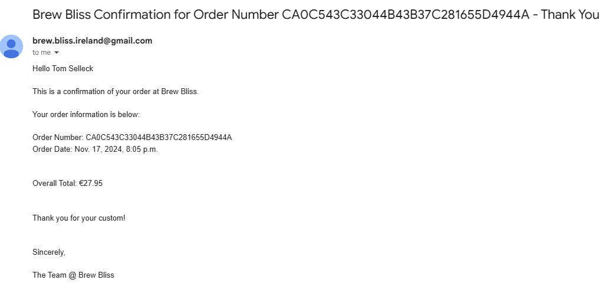

# Brew Bliss

[](https://brew-bliss-1195cd6a337d.herokuapp.com/)
[Link to Live Site](https://brew-bliss-1195cd6a337d.herokuapp.com/)

## Table of Contents

- [Introduction](#introduction)
- [User Stories](#user-stories)
- [UX](#ux)
  * [Typography](#typography)
  * [Wireframes](#wireframes)
- [Accessibility](#accessibility)
- [Database Design](#database-design)
- [Features](#features)
- [Existing Features](#existing-features)
  * [Landing Page](#landing-page)
  * [Header](#header)
  * [Shopping Cart](#shopping-cart)
  * [Products List](#products-list)
  * [Product Detail Page](#product-detail-page)
  * [Register / Login](#register---login)
  * [Checkout](#checkout)
  * [Notification Emails](#notification-emails)
  * [Footer](#footer)
  * [Notifications](#notifications)
  * [Favicon](#favicon)
  * [Products Detail](#products-detail)
  * [Custom Error Pages](#custom-error-pages)
  * [Features Left to Implement](#features-left-to-implement)
- [Technologies Used](#technologies-used)
- [Ecommerce Business Model](#ecommerce-business-model)
- [Search Engine Optimization (SEO) & Social Media Marketing](#search-engine-optimization--seo----social-media-marketing)
  * [Keywords](#keywords)
  * [Metadata](#metadata)
  * [Sitemap](#sitemap)
  * [Robots](#robots)
  * [Social Media Marketing](#social-media-marketing)
  * [Newsletter Marketing](#newsletter-marketing)
- [Testing](#testing)
  * [Browser Compatibility](#browser-compatibility)
  * [Responsiveness](#responsiveness)
  * [Performance Testing](#performance-testing)
  * [Accessibility Testing](#accessibility-testing)
  * [User Story Testing](#user-story-testing)
  * [Challenges Faced](#challenges-faced)
  * [Code Validation](#code-validation)
    + [HTML Validation](#html-validation)
    + [CSS Validation](#css-validation)
    + [Python Validation](#python-validation)
    + [JavaScript](#javascript)
- [Deployment](#deployment)
  * [PostgreSQL Database](#postgresql-database)
  * [Amazon AWS](#amazon-aws)
    + [S3 Bucket](#s3-bucket)
    + [IAM](#iam)
    + [Final AWS Setup](#final-aws-setup)
  * [Heroku Deployment](#heroku-deployment)
  * [Local Deployment](#local-deployment)
    + [Cloning](#cloning)
    + [Forking](#forking)
- [Credits](#credits)
  * [Content](#content)
  * [Code](#code)
  * [Media](#media)
  * [Acknowledgements](#acknowledgements)


## Introduction

This project was created for Code Institute's - Diploma in Full Stack Software Development (E-commerce Applications) as a PP5 Milestone.

The website features an online fictional tea supplier based in Ireland selling various Tea Leaves/Powders and Accessories.

Users including guests can browse products and add products to their cart.

Registered users can place orders, save their details for future and see their past orders.

I designed the project with Agile management principles in mind, effectively utilizing various features of GitHub, such as Issues and Projects, to implement Scrum methodology, even though I was working independently.

 My primary objective was to create a user-friendly front end that enables the business owner to manage the shop seamlessly, without the need to access the Django Admin panel.

[Kanban Board for project](https://github.com/users/carlow78/projects/6)

[Closed Issues on GitHub for the project](https://github.com/carlow78/brew-bliss/issues?q=is%3Aissue+is%3Aclosed)

I used [GitHub issues](https://github.com/carlow78/brew-bliss/issues) to track my user stories from planning to deployment. 


I used the [Milestones feature](https://github.com/carlow78/brew-bliss/milestones) to plan sprints and set deadlines.

## User Stories

User stories were prepared using GitHub Issues.

## UX


I used [Canva Color Palette Generator](https://www.canva.com/colors/color-palette-generator/) for colour schemes on the site and to save time [Bootstrap's](https://getbootstrap.com/docs/5.3/utilities/colors/#colors) colour class utility.


I used [Bootstrap Icons](https://icons.getbootstrap.com/) and  [FontAwesome Icons](https://fontawesome.com/icons) throughout the project for icons such as the cart, login etc.


I had installed the latest version of Bootstrap (5.3), but due to an issue connecting my AWS E3 bucket I had to downgrade to Bootstrap 4.2 (more on that later in the Bug Sections). Coming from IT Networking background I always tend to install the latest version of software etc for the latest security patches, bug fixes etc.


### Typography


I used 'Sour Gummy' and 'Inter' font families from [Google Fonts](https://fonts.google.com/)
. I like Sour Gummy for its playfulness and Lato for its clarity and readability.


### Wireframes

Before I started the project as I have done previously since PP2 I designed some wireframes of how I hoped the website would look like at the end of the development using [Balsamiq](https://balsamiq.com/).


Index


Products


Product View (Green Tea)

## Accessibility

Buttons featuring icons have appropriate `aria-labels` where necessary, and notification messages have `aria-live` tags and are read by screen readers.

I also used inline SVGs for some icons in the project.


## Database Design

I used [DrawSQL](https://drawsql.app/) to design the models used for the website. The application is easy to use but does contain limitation such as missing foreign key and fieldtypes.  


## Features

## Existing Features

### Landing Page

The landing (index page) contains a table of different types of teas. The image is colourful and inviting. There is also a quick and handy store link (Browse Now) for user's to go straight to the online store the main feature of the website (and money maker). And finally there is a catchy slogan "Your vibe, our leaves".


</details>

### Header

1. Starting from the top left, Store website name which is a hyperlink featuring throughout to site and when clicked returns the user to the home page(index).

2. In the centre of the screen section a navbar with dropdown menus to browse All Products, Teas, and Accessories. 

On small screens (ie mobiles), this navbar moves to the top left in the style of a hamburger menu which expands to show the dropdown menu from above.


3. In the middle of the header there is a 'Search' function which allows user to quickly find the item they want ie - Matcha Green Tea.

4. Finally in the top right there is a Login and Shopping Cart icon made using Bootstrap Icons. 

The Login button allows user to register/login and when administrators are signed in and extra menu option Item management is added to the dropdown allowing items to be added to the store rather than using the Django admin panel.

On small screens (ie mobiles), the search and Login and cart button appear as icons this time using Font Awesome icons. 


### Shopping Cart

Guests and registered users can add products to their shopping cart, and the total of their cart is displayed clearly in the navbar on medium sized screen sizes and up.


### Products List

Products appear 4 across the page on large screens and thanks to bootstrap breakpoints reduces to 3 on ipads down, 2 and finally to 1 product per line on ie for mobile. 


The products webpage also features a dropdown sort-by menu, allowing users to ie sort items by price, name etc. Only the Rating items does not function this feature is to come in a future update. 


### Product Detail Page

When a user clicks on a product it opens the individual product's details page with more details about the product and allowing the user to add additional quantitites of the product. Each time the user add more quantites to the cart they see a message of their action and cart total increasing/decreasing depending on their action.


### Register / Login

Allows users to create and login to the website. Achieved using django-all auth and customised to match the team of the website.

When a user registers for the first time they must verify their email address before being able to login.


### Checkout

When the user clicks on the cart located in the top right of the screen they are brought to cart view page showing all items in the cart.

There are links to return the store and 'keep shopping' or proceed to a 'secure checkout' page.


# Secure checkout page

When the user clicks on the 'secure checkout' link they are brought to the checkout view to fill out their delivery address details and credit card details (handled by Stripe).

Once they fill out all the required details (their address and credit card  details). They can then click on the Complete Order button.

The next stage of the process is handled by a Stripe webhook.


If the customer has a saved shipping address, they can populate the form with it by checking the box.

Stripe checks the credit card details and if they are valid processes the order is processed (achieved using a Stripe webhook).


### Notification Emails

An email is sent to the customer when they make a new order.

I used Stripe's webhooks to only send the email when the payment is successfully completed.


<summary>Screenshot of an Order Confirmation Email</summary>




</details>


### Footer

The Footer includes:

- A link to sign up for the website's newsletter (more on that later).

- A link back to the Home (index) page.

- A link to the Browse our store (products view).

- A link to the website 3 social media outlets - all links are open in a new window.


### Notifications

Django Messages (Toasts) and Bootstrap's Alerts elements were combined to make elegant dismissible notification messages when the user performs actions.

There are 4 alert messages.

Info - information for the user

Success - when the action was successful

Warning - the action failed but may be immiment

Error - action was not successful

Source https://docs.djangoproject.com/en/5.1/ref/contrib/messages/

Here is an example of a toast message on the website.


### Favicon

Created using a free tea cup clipart from [Pngtree](https://pngtree.com/so/tea-cup-clipart) and then converted to a favicon using [Favicon](https://favicon.io/favicon-converter/)


### Custom Error Page

A Custom 404 was created for when a user tries to find an non existing webpage on the website.


### Features Left to Implement

Features I didn't get to implement in this iteration but plan to add in future include:

- Guests should be able to place orders without registering for an account
- A Discount Code system or Option for time-based Sales
- Weight increments for Tea leaves/powder increasing by €2 per 100g.
- A "recently viewed" carousel of products to follow the user around the site.
- Sign in with Google
- Add a CAPTCHA or some other form of validation

## Technologies Used

- [Python](https://www.python.org/)
- [Django](https://www.djangoproject.com) used as the Python framework for the site.
- [pip](https://pip.pypa.io/en/stable/) for installing Python packages.
- [Git](https://git-scm.com/) for version control.
- [AWS S3](https://aws.amazon.com/s3) used for online static file storage.
- [PostgreSQL](https://www.postgresql.org) used as the relational database management.
- [Heroku](https://www.heroku.com) used for hosting the deployed back-end site.
- [GitHub](https://github.com/) for storing the repository online during development.
- [GitPod](https://gitpod.io/) as a cloud based IDE.
- [Balsamiq](https://balsamiq.com/wireframes/) for wireframing.
- [Bootstrap](https://getbootstrap.com/) as a front end framework.
- [Google Chrome](https://www.google.com/intl/en_ie/chrome/), [Mozilla Firefox](https://www.mozilla.org/en-US/firefox/new/) and [Safari](https://www.apple.com/safari/) for testing on macOS Monterey.
- [Microsoft Edge](https://www.microsoft.com/en-us/edge) for testing on Windows 11.
- [Safari](https://www.apple.com/safari/) on iOS and iPadOS 15.
- [Google Chrome](https://www.google.com/intl/en_ie/chrome/) on Android 12.
- [DrawSQL](https://drawsql.app/) for drawing database diagrams.
- [Brevo](https://brevo.com/) for newsletter subscription service.
- [favicon.io](https://favicon.io/favicon-generator/) to make a favicon for site.


## Ecommerce Business Model

This site sells goods to individual customers, and therefore follows a `Business to Customer` model.
It is of the simplest **B2C** forms, as it focuses on individual transactions, and doesn't need anything
such as monthly/annual subscriptions.

It is still in its early development stages, although it already has a newsletter, and links for social media marketing.

Social media can potentially build a community of users around the business, and boost site visitor numbers, especially when using larger platforms such a Facebook.

A newsletter list can be used to send regular messages to site users who opt in, such as what items are on special offer, new items in stock. See [Newsletter Marketing](#newsletter-marketing) below.

## Search Engine Optimization (SEO) & Social Media Marketing

### Keywords

I've identified some appropriate keywords to align with my site, that should help users
when searching online to find my page easily from a search engine.
I made sure to make use of semantic html so these keywords were picked up by search engines.

```html
<meta name="title" content="Brew Bliss">
<meta name="description"
            content="Luxury Tea suppliers based in Ireland. Tea leaves from across the globe. Your vibes, our leaves. Fast shipping worldwide. ">
```

### Metadata

I included Metadata to ensure thumbnails and information is presented correctly when shared on Facebook, Twitter and other Social Media.


### Sitemap

I've used [XML-Sitemaps](https://www.xml-sitemaps.com) to generate a sitemap.xml file.
This was generated using my deployed site URL: https://brew-bliss-1195cd6a337d.herokuapp.com/

After it finished crawling the entire site, it created a
[sitemap.xml](sitemap.xml) which I've downloaded and included in the repository.

### Robots

I've created the [robots.txt](robots.txt) file at the root-level.
Inside, I've included the settings:

```
User-agent: *
Disallow: /checkout/
Sitemap: https://brew-bliss-1195cd6a337d.herokuapp.com/sitemap.xml
```


### Social Media Marketing

Creating a strong social base and linking that to the business site can help drive sales.

I included links in the footer which could be used for potential Facebook, Twitter, and Instagram presences for the business.

I've created a mockup Facebook business account using the
[Balsamiq template](https://code-institute-org.github.io/5P-Assessments-Handbook/files/Facebook_Mockups.zip)
provided by Code Institute.


All images are thanks to [Freepik](https://www.freepik.com/) and feature people enjoying tea.


### Newsletter Marketing

I signed up and tried Mailchimp but when I copied the code for the embedded form to the website and inputted a brand new email which was never used on the website. The Feedback message from mailchimp stated the email address had already signed up which it hadn't. So I wanted to find an alternative. After further research I decided to try Brevo's free tier option. It's easy to use and I had the whole newsletter template created in 15 minutes and a further 15 minutes to set up a new newsletter webpage on the site. 


</details>


## Testing

I performed extensive manual testing continuously as the project was being developed. Fixing issues throughout the project.

### Responsiveness

I tested for responsiveness on many different sized viewports ie iPad, Android and using Google's Chrome Developer tools.


### Performance Testing

Performance testing was done in Google Chrome on a Windows 11 laptop.

| Page 	| Performance 	| Accessibility 	| Best Practices 	| SEO 	|
|---	|---	|---	|---	|---	|

| [Landing Page](docs/images/validation/lighthouse-landing.jpg) 	| 97 	| 88 	| 100 	| 100 	|

| [Products List](docs/images/validation/lighthouse-products.jpg) 	| 86 	| 85 	| 100 	| 100 	|

| [Product Detail](docs/images/validation/lighthouse-product-view.jpg) 	| 94 	| 91 	| 96 	| 100 	|

| [Manage Products](docs/images/validation/lighthouse-manage.jpg) 	| 94 	| 89 	| 100 	| 100 	|

</details>


### User Story/Functionality Testing

User Stories were used throughout the development of the project and tracked using [Github Issues](https://github.com/carlow78/brew-bliss/issues?q=is%3Aissue+is%3Aclosed)

<details>
<summary>New user account registration</summary>

As a <b>user</b>, <b>I can register for a new account</b> so that <b>I can save my details to speed up future transactions on the website</b>.

ACCEPTANCE CRITERIA:

1. Offer a new user the facility to Register
2. New user can create valid username and password

Tested 15/01/2025

**Result:** ✅ Pass
</details>

<details>
<summary>View list of items</summary>

As a <b>shopper</b> I can view list of items for sale so that <b>I can add to cart if I want to.</b>

ACCEPTANCE CRITERIA:

1. All items are visible when View All Items is clicked
2. Items are arranged in a readable manner and adapted to screen size

Tested 15/01/2025

**Result:** ✅ Pass
</details>

<details>
<summary>View an individual item</summary>

As a <b>shopper</b> I can <b>select an item individually</b> so that <b>I can read more about it.</b>

ACCEPTANCE CRITERIA:

1. I can click on an item to view more details
2. Responds to different screen sizes
3. Rating information included
4. Select the number of items I want
5. Add item to cart

Tested 15/01/2025

**Result:** ✅ Pass
</details>

<details>
<summary>Search feature</summary>

As a <b>site user</b> I can <b>search the website</b> so that <b>I can locate item(s)</b>

ACCEPTANCE CRITERIA:

1. Search bar in header section
2. Placeholder text describing feature
3. Search returns items matching user inputted text

Tested 15/01/2025

**Result:** ✅ Pass
</details>

<details>
<summary>View item(s) in shopping cart</summary>

As a <b>site user</b> I can <b>view all items</b> so that <b>I can see the total amount I have in it and how much I need to add to qualify for FREE DELIVERY (if desired).</b>

ACCEPTANCE CRITERIA:

1. Bag icon/link visible
2. Total amount in my basket (including delivery if applicable)
3. Amount remaining to qualify for FREE DELIVERY (if applicable)

Tested 15/01/2025

**Result:** ✅ Pass
</details>

<details>
<summary>Sort view</summary>

As a <b>site user</b> I can <b>view all items</b> so that <b>I can see the total amount I have in it and how much I need to add to qualify for FREE DELIVERY (if desired).</b>

ACCEPTANCE CRITERIA:

1. Dropdown menu allowing users to sort by different categories
2. View changes based on what selected from dropdown

Tested 15/01/2025

**Result:** ✅ Pass
</details>

<details>
<summary>Notification messages after user actions</summary>

As a <b>site user</b> I can <b>view messages</b> so that <b>confirm my action as been successfully performed or if more details are needed and what is missing.</b>

ACCEPTANCE CRITERIA:

1. User sees notifications to confirm after they performed an action in the website
2. User can close the message when they click on the x (close) button

Tested 15/01/2025

**Result:** ✅ Pass
</details>

<details>
<summary>Credit card purchasing/Order Confirmation/Confirmation email after successful purchase</summary>

Part 1: As a <b>site user</b> I can <b>enter my delivery address and credit card details</b> so that <b>I can buy item(s) I require</b>
Part 2: As a <b>site user</b> I can <b>aspect to see a confirmation page</b> so that <b>I can view the order details.</b>
Part 3: As a <b>site user</b> I can <b>expect to receive a confirmation email</b> so that <b>I have a record of the purchase.</b>

ACCEPTANCE CRITERIA:

1. Provide checkout forms - delivery form, credit card form
2. Install stripe and create webhook
3. Order confirmation page
4. Email is sent to user once their order is paid using credit card

Tested 15/01/2025 (More details of testing performed please see [Checkout](#checkout) section)

**Result:** ✅ Pass
</details>

<details>
<summary>Add Product(s) to Wishlist</summary>

As a <b>site user</b>, I can add a product(s) to a wishlist page so that Ican buy later, ie: when I can afford to buy

ACCEPTANCE CRITERIA:

1. Add Wishlist button on Product Detail page
2. Add Wishlist View - View/Delete
3. Test using a signed-in user can view their wishlist from their account page/user must be signed in to add item to wishlist

Tested 18/01/2025

! [Wishlist](docs/images/wishlist-view.jpg) 

**Result:** ✅ Pass
</details>

<details>
<summary>Review Product</summary>

As a <b>site-user</b> I can <b>review a product</b> so that I can <b>provide my opinion of the product for others to view</b>

ACCEPTANCE CRITERIA:

1. Add ability for a signed-in user (only) to provide reviews

Tested 18/01/2025

 

**Result:** ✅ Pass
</details>


### Challenges Faced

Initially, I had hoped to provide Tea/Leaf/Weigh option with differenting weights allowing users to buy tea leaves/powders in 5 increments starting at 100,200,300,400,500g. The price increasing by 2 euros for each increment which I did achieve using a script but after nearly 2 days trying to get the context_process cart to update with increments when a user chooses 200-500g I couldnt resolve so I had to shelf the idea. 

Inspiration for weighting tea -
https://threespoons.ie/shop/tea/black-tea/assam-op-leaf-blend-black-tea/ 

<b> This Item pricing started from €5.20 for 100g, €9.40 for 200g and 500g for €21.40.</b>

I had issues connecting to my AWS bucket from Heroku to access/store my static and media project files. Since the Walkthrough was recorded 4 years the steps to create AWS S3 and IAM has changed greatly. I contacted tutor support twice for my first session after an hour of troubleshooting with the Tutor he sent me an updated documentation of the process stored on Google Docs but still no joy. After my second tutor session lasting another 1 hour there was still no joy. Before finishing the session he suggested trying the steps again and maybe try to downgrade Django 4.2 (from 5.3) which thankfully resolved to issue but this issue had set me back more time (2 days and approx 50 redeployments to heroku) which I was running out of.

Finally the last main issue I encountered was the navigation hamburger menu not expanding on mobile (smaller) screens. I finally got the issue resolved after downgrading bootstrap JS CDNs from 5.3 to 5.2 in the base.html corejs section after finding this [Youtube](https://www.youtube.com/watch?v=a-VSiUtMayM&t=42s) video.


### Code Validation

#### HTML Validation

Pages were validating using the [W3 HTML Validator](https://validator.w3.org/nu/) on Windows Chrome.

<details>
<summary>W3 HTML Validation</summary>

<b>cart.html</b>


<b>Checkout_success.html</b>


<b>Checkout.html</b>


The 7 errors related to the fact { was present due to Django being involved.
No other errors

<b>Index.html</b>


<b>Newsletter.html</b>


Brevo Newsletter Form content left unchanged.


</details>

#### CSS Validation

The custom CSS was validated using the [W3C CSS Validation Service](https://jigsaw.w3.org/css-validator/) as CSS level 3 + SVG. 


File | Result |
-----|--------|
`base.css` | [✅ Pass](docs/images/validation/base-css.jpg) |
`checkout.css` | [✅ Pass](docs/images/validation/checkout-css.jpg) |
`profile.css` | [✅ Pass](docs/images/validation/profile-css.jpg) |


#### Python Validation

All the custom Python files passed PEP8 Validation using [CI Python Linter](https://pep8ci.herokuapp.com/).

`# noqa` was used in cases where line breaks in strings would have broken Django functionality.

| App                | File | Result |
|-------------|------------------|--------|
|         | `settings.py`            | [✅ Pass](docs/images/validation/settings-py.jpg) |
|         | `custom_storages.py`            | [✅ Pass](docs/images/validation/custom-storages-py.jpg) |
| Cart        | `cart_tools.py`            | [✅ Pass](docs/images/validation/cart-tools.jpg)
| Cart        | `context.py`            | [✅ Pass](docs/images/validation/context-py.jpg) | |
| cart        | `views.py`            | [✅ Pass](docs/images/validation/cart-views-py.jpg) |
| cart        | `urls.py`            | [✅ Pass](docs/images/validation/cart-urls-py.jpg) |
| checkout        | `admin.py`            | [✅ Pass](docs/images/validation/checkout-admin-py.jpg) |
| checkout        | `apps.py`            | [✅ Pass](docs/images/validation/checkout-apps-py.jpg) |
| checkout        | `forms.py`            | [✅ Pass](docs/images/validation/checkout-admin-py.jpg) |
| checkout        | `models.py`            | [✅ Pass](docs/images/validation/checkout-models-py.jpg) |
| checkout        | `signals.py`            | [✅ Pass](docs/images/validation/checkout-signals-py.jpg) |
| checkout        | `urls.py`            | [✅ Pass](docs/images/validation/checkout-urls-py.jpg) |
| checkout        | `views.py`            | [✅ Pass](docs/images/validation/checkout-views-py.jpg) |
| checkout        | `webhook_handlers.py`            | [✅ Pass](docs/images/validation/checkout-webhook-handler-py.jpg) |
| home        | `views.py`            | [✅ Pass](docs/images/validation/home-views-py.jpg) |
| products        | `admin.py`            | [✅ Pass](docs/images/validation/products-admin-py.jpg) |
| products        | `forms.py`            | [✅ Pass](docs/images/validation/products-form-py.jpg) |
| products        | `view.py`            | [✅ Pass](docs/images/validation/products-view-py.jpg) |
| products        | `models.py`            | [✅ Pass](docs/images/validation/products-model-py.jpg) |
| profiles        | `models.py`            | [✅ Pass](docs/images/validation/profiles-models-py.jpg) |
| profiles        | `views.py`            | [✅ Pass](docs/images/validation/profile-views-py.jpg |


#### JavaScript

File | Result |

`stripe_elements.js` | [✅ Pass](docs/images/validation/stripe-elements-js.jpg) |

---

## Deployment

The live deployed application can be found deployed on [Heroku](https://brew-bliss-1195cd6a337d.herokuapp.com/).

### PostgreSQL from Code Instiute Database

This project uses PostgreSQL Database.

To obtain your own Postgres Database, use this https://dbs.ci-dbs.net/ input your registered email address used to sign up to Code Institute. (Each student can have a maximum of 8 which are deleted after 18 months). You will then receive your PostgreSQL database URL which can be used for your website.

### Amazon AWS

This project uses [AWS](https://aws.amazon.com) to store media and static files online, due to the fact that Heroku doesn't persist this type of data.

Once you've created an AWS account and logged-in, follow these series of steps to get your project connected.
Make sure you're on the **AWS Management Console** page.

<details>
<summary>Full details of setting up AWS for deployment</summary>

#### S3 Bucket

- Search for **S3**.
- Create a new bucket, give it a name (matching your Heroku app name), and choose the region closest to you.
- Uncheck **Block all public access**, and acknowledge that the bucket will be public (required for it to work on Heroku).
- From **Object Ownership**, make sure to have **ACLs enabled**, and **Bucket owner preferred** selected.
- From the **Properties** tab, turn on static website hosting, and type `index.html` and `error.html` in their respective fields, then click **Save**.
- From the **Permissions** tab, paste in the following CORS configuration:

	```shell
	[
		{
			"AllowedHeaders": [
				"Authorization"
			],
			"AllowedMethods": [
				"GET"
			],
			"AllowedOrigins": [
				"*"
			],
			"ExposeHeaders": []
		}
	]
	```

- Copy your **ARN** string.
- From the **Bucket Policy** tab, select the **Policy Generator** link, and use the following steps:
	- Policy Type: **S3 Bucket Policy**
	- Effect: **Allow**
	- Principal: `*`
	- Actions: **GetObject**
	- Amazon Resource Name (ARN): **paste-your-ARN-here**
	- Click **Add Statement**
	- Click **Generate Policy**
	- Copy the entire Policy, and paste it into the **Bucket Policy Editor**

		```shell
		{
			"Id": "Policy1234567890",
			"Version": "2012-10-17",
			"Statement": [
				{
					"Sid": "Stmt1234567890",
					"Action": [
						"s3:GetObject"
					],
					"Effect": "Allow",
					"Resource": "arn:aws:s3:::your-bucket-name/*"
					"Principal": "*",
				}
			]
		}
		```

	- Before you click "Save", add `/*` to the end of the Resource key in the Bucket Policy Editor (like above).
	- Click **Save**.
- From the **Access Control List (ACL)** section, click "Edit" and enable **List** for **Everyone (public access)**, and accept the warning box.
	- If the edit button is disabled, you need to change the **Object Ownership** section above to **ACLs enabled** (mentioned above).

#### IAM

Back on the AWS Services Menu, search for and open **IAM** (Identity and Access Management).
Once on the IAM page, follow these steps:

- From **User Groups**, click **Create New Group**.
	- Suggested Name: `group-coffeecrew` (group + the project name)
- Tags are optional, but you must click it to get to the **review policy** page.
- From **User Groups**, select your newly created group, and go to the **Permissions** tab.
- Open the **Add Permissions** dropdown, and click **Attach Policies**.
- Select the policy, then click **Add Permissions** at the bottom when finished.
- From the **JSON** tab, select the **Import Managed Policy** link.
	- Search for **S3**, select the `AmazonS3FullAccess` policy, and then **Import**.
	- You'll need your ARN from the S3 Bucket copied again, which is pasted into "Resources" key on the Policy.

		```shell
		{
			"Version": "2012-10-17",
			"Statement": [
				{
					"Effect": "Allow",
					"Action": "s3:*",
					"Resource": [
						"arn:aws:s3:::your-bucket-name",
						"arn:aws:s3:::your-bucket-name/*"
					]
				}
			]
		}
		```
	
	- Click **Review Policy**.
	- Suggested Name: `policy-coffeebliss` (policy + the project name)
	- Provide a description:
		- "Access to S3 Bucket for coffeecrew static files."
	- Click **Create Policy**.
- From **User Groups**, click your "group-brewbliss".
- Click **Attach Policy**.
- Search for the policy you've just created ("policy-coffeecrew") and select it, then **Attach Policy**.
- From **User Groups**, click **Add User**.
	- Suggested Name: `user-coffeecrew` (user + the project name)
- For "Select AWS Access Type", select **Programmatic Access**.
- Select the group to add your new user to: `group-brewbliss`
- Tags are optional, but you must click it to get to the **review user** page.
- Click **Create User** once done.
- You should see a button to **Download .csv**, so click it to save a copy on your system.
	- **IMPORTANT**: once you pass this page, you cannot come back to download it again, so do it immediately!
	- This contains the user's **Access key ID** and **Secret access key**.
	- `AWS_ACCESS_KEY_ID` = **Access key ID**
	- `AWS_SECRET_ACCESS_KEY` = **Secret access key**

#### Final AWS Setup

- If Heroku Config Vars has `DISABLE_COLLECTSTATIC` still, this can be removed now, so that AWS will handle the static files.
- Back within **S3**, create a new folder called: `media`.
- Select any existing media images for your project to prepare them for being uploaded into the new folder.
- Under**Manage Public Permissions**, select**Grant public read access to this object(s)**.
- No further settings are required, so click**Upload**.

</details>

### Heroku Deployment

This project uses [Heroku](https://www.heroku.com), a platform as a service (PaaS) that enables developers to build, run, and operate applications entirely in the cloud.

Deployment steps are as follows, after account setup:

- Select**New** in the top-right corner of your Heroku Dashboard, and select**Create new app** from the dropdown menu.
- Your app name must be unique, and then choose a region closest to you (EU or USA), and finally, select**Create App**.
- From the new app**Settings**, click**Reveal Config Vars**, and set your environment variables.

| Key | Value |
| --- | --- |
| `AWS_ACCESS_KEY_ID` | insert your own AWS Access Key ID key here |
| `AWS_SECRET_ACCESS_KEY` | insert your own AWS Secret Access key here |
| `AWS_S3_REGION_NAME` | region name of the AWS region used (e.g 'eu-west-1')
| `AWS_STORAGE_BUCKET_NAME` | name of the bucket in AWS
| `DATABASE_URL` | insert your own PostgreSQL database URL here |
| `DISABLE_COLLECTSTATIC` | 1 (*this is temporary, and can be removed for the final deployment*) |
| `SECRET_KEY` | insert your Django secret key
| `EMAIL_HOST_PASS` | insert your own Gmail API key here |
| `EMAIL_HOST_USER` | insert your own Gmail email address here |
| `SECRET_KEY` | this can be any random secret key |
| `STRIPE_PUBLIC_KEY` | insert your own Stripe Public API key here |
| `STRIPE_SECRET_KEY` | insert your own Stripe Secret API key here |
| `STRIPE_WH_SECRET` | insert your own Stripe Webhook API key here |
| `EMAIL_HOST_USER` | insert your email address for sending emails (I used a Gmail account)
| `EMAIL_HOST_PASS` | insert your app password for the email address
| `USE_AWS` | True |
| `HEROKU_HOSTNAME` | insert url of deployed project on Heroku

Heroku needs two additional files in order to deploy properly.
- requirements.txt
- Procfile

You can install this project's **requirements** (where applicable) using:
- `pip3 install -r requirements.txt`

If you have your own packages that have been installed, then the requirements file needs updated using:
- `pip3 freeze --local > requirements.txt`

The **Procfile** can be created with the following command:
- `echo web: gunicorn app_name.wsgi > Procfile`
- *replace **app_name** with the name of your primary Django app name; the folder where settings.py is located*

For Heroku deployment, follow these steps to connect your own GitHub repository to the newly created app:

Either:
- Select **Automatic Deployment** from the Heroku app.

Or:
- In the Terminal/CLI, connect to Heroku using this command: `heroku login -i`
- Set the remote for Heroku: `heroku git:remote -a app_name` (replace *app_name* with your app name)
- After performing the standard Git `add`, `commit`, and `push` to GitHub, you can now type:
	- `git push heroku main`

The project should now be connected and deployed to Heroku!

### Local Deployment

This project can be cloned or forked in order to make a local copy on your own system.

For either method, you will need to install any applicable packages found within the *requirements.txt* file.
- `pip3 install -r requirements.txt`.

You will need to create a new file called `env.py` at the root-level,
and include the same environment variables listed above from the Heroku deployment steps.

Sample `env.py` file:

```python
import os

os.environ.setdefault["AWS_ACCESS_KEY_ID"] = insert your own AWS Access Key ID key here
os.environ.setdefault["AWS_SECRET_ACCESS_KEY"] = insert your own AWS Secret Access key here
os.environ.setdefault["AWS_S3_REGION_NAME"] = insert your AWS bucket region here e.g. 'eu-central-2'
os.environ.setdefault["AWS_STORAGE_BUCKET_NAME"] = insert your own AWS Secret Access key here
os.environ.setdefault["DATABASE_URL"] = insert your own ElephantSQL database URL here
os.environ.setdefault["EMAIL_HOST_PASS"] = insert your own Gmail API key here
os.environ.setdefault["EMAIL_HOST_USER"] = insert your own Gmail email address here
os.environ.setdefault["SECRET_KEY"] = this can be any random secret key
os.environ.setdefault["STRIPE_PUBLIC_KEY"] = insert your own Stripe Public API key here
os.environ.setdefault["STRIPE_SECRET_KEY"] = insert your own Stripe Secret API key here
os.environ.setdefault["STRIPE_WH_SECRET"] = insert your own Stripe Webhook API key here
os.environ.setdefault["STRIPE_RETURN_URL"] = URL for the return address in the Stripe JS
os.environ.setdefault["EMAIL_HOST_USER"] = Email address for email account used to sent emails (I used Gmail)
os.environ.setdefault["EMAIL_HOST_PASS"] = App Password for the email account used
os.environ.setdefault["HEROKU_HOSTNAME"] = insert url of deployed project on Heroku

# local environment only (do not include these in production/deployment!)
os.environ.setdefault("DEBUG", "True")
```

Once the project is cloned or forked, in order to run it locally, you'll need to follow these steps:
- Start the Django app: `python3 manage.py runserver`
- Stop the app once it's loaded: `CTRL+C` or `⌘+C` (Mac)
- Make any necessary migrations: `python3 manage.py makemigrations`
- Migrate the data to the database: `python3 manage.py migrate`
- Create a superuser: `python3 manage.py createsuperuser`
- Load fixtures (if applicable): `python3 manage.py loaddata file-name.json` (repeat for each file)
- Everything should be ready now, so run the Django app again: `python3 manage.py runserver`

If you'd like to backup your database models, use the following command for each model you'd like to create a fixture for:
- `python3 manage.py dumpdata your-model > your-model.json`
- *repeat this action for each model you wish to backup*

#### Cloning

You can clone the repository by following these steps:

1. Go to the [GitHub repository](https://github.com/carlow78/brew-bliss) 
2. Locate the Code button above the list of files and click it 
3. Select if you prefer to clone using HTTPS, SSH, or GitHub CLI and click the copy button to copy the URL to your clipboard
4. Open Git Bash or Terminal
5. Change the current working directory to the one where you want the cloned directory
6. In your IDE Terminal, type the following command to clone my repository:
	- `git clone https://github.com/carlow78/brew-bliss.git`
7. Press Enter to create your local clone.


#### Forking

By forking the GitHub Repository, we make a copy of the original repository on our GitHub account to view and/or make changes without affecting the original owner's repository.
You can fork this repository by using the following steps:

1. Log in to GitHub and locate the [GitHub Repository](https://github.com/carlow78/brew-bliss)
2. At the top of the Repository (not top of page) just above the "Settings" Button on the menu, locate the "Fork" Button.
3. Once clicked, you should now have a copy of the original repository in your own GitHub account!


*** 

## Credits 

### Content and Code
Code Institute's [Boutique Ado Walkthrough](https://github.com/Code-Institute-Solutions/boutique_ado_v1/tree/master/) which I followed along with while coding this project. 
Davidindublin [CoffeeCrew](https://github.com/davidindub/coffeecrew?tab=readme-ov-file) PP5 project for inspiration and coding tips and his readme which I have reused to create this readme file. 
[Three Spoon's](https://threespoons.ie/) website which I used for inspiration as well tea descriptions and tea leaf images. 


### Media

- [Bootstrap Icons](https://icons.getbootstrap.com/) were used extensively in the project.
-[Three Spoon's](https://threespoons.ie/) for tea descriptions and tea leaf images.
- Landing and newsletter images from [Freepik](https://freepik.com/).
- Brew Bliss Logo created using [Canva Logo Creator](https://www.canva.com/create/logos/) and modified using GIMP Editor tool.
- Accessories images from [Amazon](https:amazon.co.uk)

  
  
### Acknowledgements

- Thank you to my CI Mentor [Precious Ijege] for his help and suggestions, CI's Tutor Support, Django documentation, Bootstrap, You tube for tutorials and Stackover and CI's Slack Community.